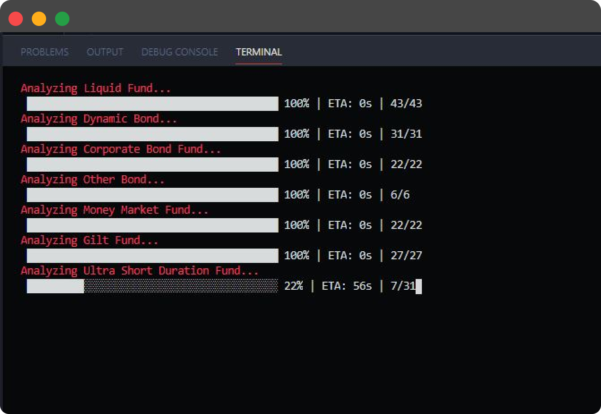
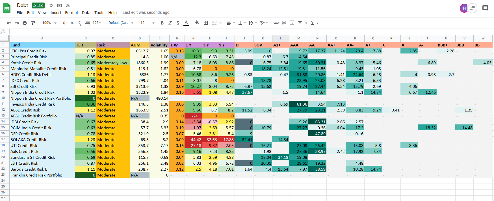
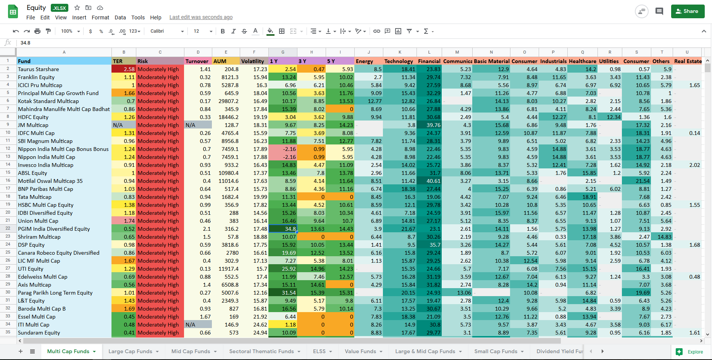

# Investment Analysis

These days we have an enormous number of Mutual Funds with different categories. This project aims to analyze the main classifications of Mutual Funds.

- Equity
- Debt
- Hybrid

In each of these classifications, we further have subclassifications of funds that sums close to a thousand. If anyone wants to invest any sum of money, it would be very exhausting to choose a fund or explore all the choices.

This application uses [Kuvera](https://kuvera.in/)'s public APIs to get all the mutual funds information and analyze it and after that app will generate **Heat Map Spreadsheets**.

> A Data Heat Map highlights each cell with a different colour depending on the figure

<br>

*To start the application, run the following commands:*

```
https://github.com/puneet222/investment-analysis.git

cd investment-analysis

npm install

npm start
```

In the cli terminal, the user can also view real-time progress and see which type of funds are analyzing.
<br/>
<br/>


<br/>

Here are some examples of Heat Map Spreadsheet that app will generate
<br/>
<br/>


*Debt | Credit Risk Funds*
<br/>
<br/>


*Equity | Multi Cap Funds*
<br/>
<br/>
This project is right now in progress here are a few things that are pending:
- [ ] Adding cell heat map on turnover ratio column
- [ ] Adding cell heat map on AUM column
- [ ] Adding cell heat map on volatility column
- [x] Add Progress bar while analysing the fund


